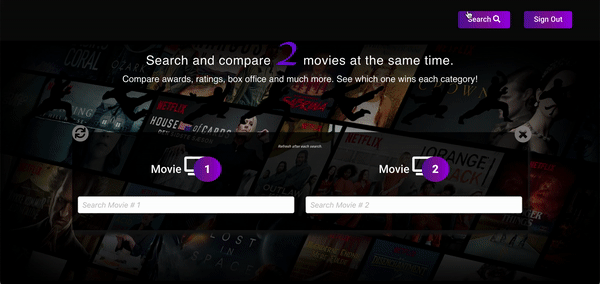

# iFlix 

iFlix is a website where you can find a variety of movies (& TV shows) data such as IMDB ratings, IMDB votes, nominations and awards, metascores and box office hits.

The main feature of iFlix is 'Flix Fight'. 
Flix Fight:
- Allows users to conduct a search of two movie titles at the same time
- Returns the results of the search in the form of 5 categories for each movie.
- The score are highlighted in different colors to showcase the winning and losing movie for each category.

Categories are: 
 IMDB ratings
 IMDB votes
 Nominations and awards
 Metascores 
 Box office hits

iFlix also features up and coming movies and tv shows as well as the latest celebrity news.

## How it works

### Movie Search

- Click search button and type in movie title to get brief description of Movies and TV Shows. 

### Flix Fight 
##### Search and compare 2 movies
- The Flix Fight page allows users to for two movies and compare them simultaneously. 
- A gold star indicates that the movie ranked higher in that specific category. 

<!--  -->

<!--  -->

### Views

Home Page
<!-- 
 -->

Sign Up Page

Sign In Page

