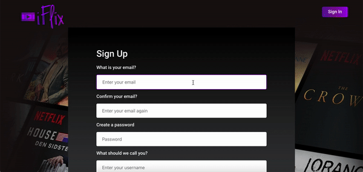
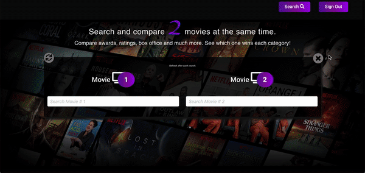

# iFlix 

iFlix is a website where you can find a variety of movies (& TV shows) data such as IMDB ratings, IMDB votes, nominations and awards, metascores and box office hits.

The main feature of iFlix is 'Flix Fight'. 
Flix Fight:
- Allows users to conduct a search of two movie titles at the same time
- Returns the results of the search in the form of 5 categories for each movie.
- The score are highlighted in different colors to showcase the winning and losing movie for each category.

Categories are: 
 IMDB ratings
 IMDB votes
 Nominations and awards
 Metascores 
 Box office hits

iFlix also features up and coming movies and tv shows as well as the latest celebrity news.

## How it works

### Step 1 - Sign Up

Fill in Sign up detail

### Step 2 - Sign In

Sign in to get access to Flix Fight page

### Step 3 - Movie Search
###### The user can search for movie info (using the search button located at the top of the page) or do a flix fight search to compare movie statistics.

- To search - Click search button and type in movie title to get brief description of Movies and TV Shows. 

### Step 4 - Flix Fight Search  
##### Search and compare 2 movies
###### The user can search for movie info (using the search button located at the top of the page) or do a flix fight search to compare movie statistics.

- The Flix Fight page allows users to for two movies and compare them simultaneously. 
- A gold star indicates that the movie ranked higher in that specific category. 

## Full Page Views

Home Page

Flix Fight full page view

## Note

I used the meta tag below to prevent the 'Mixed Block Content' error

### Meta tag

<meta http-equiv="Content-Security-Policy" content="upgrade-insecure-requests">

### Error

Mixed Content: The page at 'https://pagename.com' was loaded over HTTPS, but requested an insecure XMLHttpRequest endpoint 'http://XX.XXX.XX.XXX/vicidial/non_agent_api.php?queries=query=data'. This request has been blocked; the content must be served over HTTPS.

###### Solution from: https://stackoverflow.com/questions/33507566/mixed-content-blocked-when-running-an-http-ajax-operation-in-an-https-page

